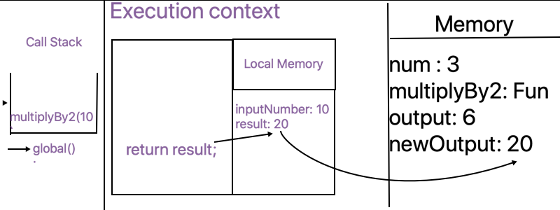

### JavaScript Principles

- When the javascript code runs, it:
  - Goes through the code line-by-line and runs/‘executes’  each line - known as the thread of execution
  - Saves ‘data’ like strings and arrays so we can use that data later - in its memory
  
We can even save code (‘functions’)


**Functions**

Code we save (‘define’) functions & can use (call/invoke/execute/run) later with the function’s name & ()

**Functions in javascript = first class object**

The can co-exit with and can be treated like any other javascript object
 
 1. Assigned to variables and properties of other objects
 2. Passed as argument into functions
 3. Returned as value from functions
 
For example

```javascript
const num = 3;

function multiplyBy2(inputNumber) {
  const result = inputNumber * 2;
  return result;
}

const output = multiplyBy2(num);
const newOutput = multiplyBy2(10);
```
1 . Initially variables and functions are stored in global memory

`
num: 3;
multiplyBy2: Function;
output: __
`

2 . puts `multiplyBy2(3)` in the Call stack

**Call stack**
- JavaScript keeps track of what function is currently running (where’s the thread of execution)
- Run a function - add to call stack 
- Finish running the function - JS removes it from call stack
- Whatever is stop of the call stack - that’s the function we’re currently running

```javascript
const output = multiplyBy2(num); //This `const output = multiplyBy2(num);` in `Execution context`
```

### Execution context
**Created and run the code of a function - has 2 parts**
- [x] Thread of execution
- [x] Memory

```javascript
function multiplyBy2(inputNumber) {
  const result = inputNumber * 2;
  return result;
}
```
The photo below shows you how it works


The same will happen on the following line: 
```javascript
const newOutput = multiplyBy2(10); //This `const newOutput = multiplyBy2(10);` in `Execution context`
```



