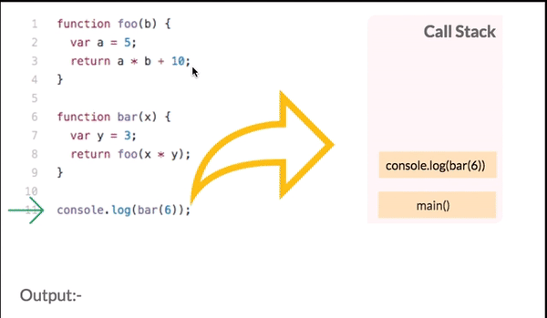
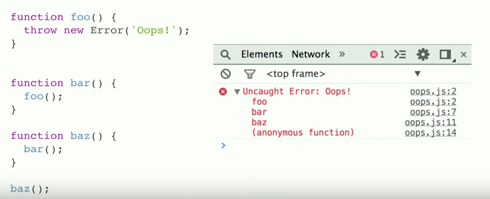

### 1) Principles of JavaScript

- When the javascript code runs, it:
  - Goes through the code line-by-line and runs/‘executes’  each line - known as the thread of execution
  - Saves ‘data’ like strings and arrays so we can use that data later - in its memory
  
We can even save code (‘functions’)


**Functions**

Code we save (‘define’) functions & can use (call/invoke/execute/run) later with the function’s name & ()

**Functions in javascript = first class object**

The can co-exit with and can be treated like any other javascript object
 
 1. Assigned to variables and properties of other objects
 2. Passed as argument into functions
 3. Returned as value from functions
 
For example

```javascript
const num = 3;

function multiplyBy2(inputNumber) {
  const result = inputNumber * 2;
  return result;
}

const output = multiplyBy2(num);
const newOutput = multiplyBy2(10);
```
1 . Initially variables and functions are stored in global memory

`
num: 3;
multiplyBy2: Function;
output: __
`

2 . puts `multiplyBy2(3)` in the Call stack

3 . Execution context `multiplyBy2(3)`

**Call stack**
- JavaScript keeps track of what function is currently running (where’s the thread of execution)
- Run a function - add to call stack 
- Finish running the function - JS removes it from call stack
- Whatever is stop of the call stack - that’s the function we’re currently running



You all must have seen the long red error stack trace sometimes in our browser console, that basically indicates the current state of the call stack and where in the function it failed in a top to bottom manner just like stack 
(see image below)



Sometimes, we get into an infinite loop as we call a function multiple times recursively and as for Chrome browser, there is a limit on the size of the stack which is 16,000 frames , more than that it will just kill things for you and throw Max Stack Error Reached 
(image below).


---------------------------------------------

**Execution context**

```javascript
function multiplyBy2(inputNumber) {
  const result = inputNumber * 2;
  return result;
}
```

Created and run the code of a function - has 2 parts
- [x] Thread of execution
- [x] Memory

```javascript
const output = multiplyBy2(num); //This `const output = multiplyBy2(num);` in `Execution context`
```

The photo below shows you how it works


The same will happen on the following line: 
```javascript
const newOutput = multiplyBy2(10); //This `const newOutput = multiplyBy2(10);` in `Execution context`
```


-----------------------------------------
Let’s understand this with the help of an example:

```javascript
var a = 10;

function functionA() {

	console.log("Start function A");

	function functionB(){
		console.log("In function B");
	}

	functionB();

}

functionA();

console.log("GlobalContext");
```

----------------------------------------

### 2) Callbacks & Higher order functions

Why do we even have functions?

Let's see why ...

Create function 10 squared
- Takes no input
- Returns 10*10

What is the syntax (the exact code we type)?

```javascript
function tenSquared() {
  return 10 * 10;
}

tenSquared(); // 100
```
OK... What about a 9 squared function?

```javascript
function nineSquared() {
  return 9 * 9;
}

nineSquared(); // 81
```
And 8 squared function? 125 squared?

What principle are we breaking? - **DRY (Don't Repeat Yourself)** 
This is a fundamental principle in programming

We can generalize the function to make it reusable

```javascript
function squareNum(num) {
  return num * num;
}

squareNum(10); // 100
squareNum(9); // 81
squareNum(8); // 64
```

**Generalize functions**

‘Parameters’ (placeholders) mean we don’t need to decide what data to run our functionality on until we run the function
- Then provide an actual value (‘argument’) when we run the function

**Higher order functions follow same principle.**

We may not want to decide exactly what some of our functionality is until we run our function
- The outer function that takes in a function is our higher-order function
- The function we insert in our callback function (callback function)

**Higher-order functions**
- Takes in a function or passes out  function

Now suppose we have  function `copyArrayAndMultiplyBy2`

```javascript
function copyArrayAndMultiplyBy2(array) {
  const outer = [];
  for(let i = 0; i < array.length; i++) {
    outer.push(array[i] * 2);
  }
  return outer;
}

const myArray = [1,2,3];
const result = copyArrayAndMultiplyBy2(myArray);
```

What if want to copy array and divide by 2?

```javascript
function copyArrayAndDivideBy2(array) {
  const outer = [];
  for(let i = 0; i < array.length; i++) {
    outer.push(array[i] / 2);
  }
  return outer;
}

const myArray = [1,2,3];
const result = copyArrayAndDivideBy2(myArray);
```

This is really problematic...

must be a better way

We can generalize our function - so we pass in our specific instruction only when
we run **copyArrayAndManipulate**

```javascript
function copyArrayAndManipulate(array, instructions) {
  const outer = [];
  for(let i = 0; i < array.length; i++) {
    outer.push(instructions(array[i]));
  }
  return outer;
}


const result = copyArrayAndManipulate([1,2,3], input => input * 2);
```

**Callbacks and higher order functions simplify our code and keep it DRY**
- Declarative readable code: map, filter, reduce - the most readable way to write code to work with data
- Asynchronous JavaScript: callbacks are a core aspect of async JavaScript, and are under-the-hood of promises, async/await

Which is our Higher order function? - 
The outer function that takes in a function is our higher-order function.

Which is our Callback function? - 
The function we insert is our callback function

### 3) Closure (scope and execution context)

**What is a Closure?**

A **closure** is the combination of a function bundled together (enclosed) with references to its surrounding state (the **lexical environment**). In other words, a closure gives you access to an outer function’s scope from an inner function. In JavaScript, closures are created every time a function is created, at function creation time.

**Closure**
- Closure is the most esoteric of javascript concepts
- Enables powerful pro-level functions like ‘once’ and ‘memoize’
- Many JavaScript design patterns including the module pattern use closure
- Build iterators, handle partial application and maintain state in an asynchronous world
- Functions with memories
- When the function get call, we create a live tore of data (local memory/ variable environment/state) for the function’s execution context

Closure gives our functions persistent memories and entire new toolkit for writing ✍️ professional code
- Helper functions: everyday professional helper functions like ‘once’ and ‘memoize’
- Iterator and generators: which use lexical scoping and closure to achieve the most contemporary patterns for handling data in javascript
- Module pattern: preserve state for the life of an application without polluting the global namespace
- Asynchronous JavaScript: callbacks and promises rely on closure to persist state in an synchronous environment

Let’s understand this with the help of an example:

```javascript
function outer() {
  let counter = 0;
  function incCount() { counter++; }
  return incCount;
}

const myNewFunc = outer();
```

what will happen? (see image below)


The `Backpack` (or `Closure`) of live data is attached
`incCount` (then to `myNewFunc`) throught a hidden property
known as `[[scope]]` which persists when the inner function
is returned out;


Let's execute `myNewFunc`

```javascript
myNewFunc();
```

what will happen? (see image below)


Let's execute `myNewFunc` a second time

```javascript
myNewFunc();
```


**If you console log function definition, it has hidden property `[[scope]]` (it links to store data)**

Closure technical definition
- Closed over `variable environment` [C.O.V.E]
- Persistent lexical scope referenced data [P.L.S.R.D] //What is scope? - 
Scope is rules in any programming language for at any given line of code, what data do i have available for me
- `Backpack`
- `Closure`

### 4) Asynchronous javascript & the event loop
**JavaScript is not enough - We need new pieces (Some of Which aren't JavaScript at all)**

**Our JavaScript engine has 3 main parts:**
- Thread of execution 
- Memory/variable environment 
- Call stack

**We need to add new components:**
- Web Browser APIs/Node background APIs
- Promises
- Event loop, Callback/Task queue and micro task queue

**JS + Web Browser**

| JS  | Web Browser |
| ------------- | ------------- |
| setTimeout()  | Timer  |
| document | HTML Dom  |
| XHR/fetch()  | Network  |
| console | console /Dev-tool   |
| localStorage  | Local storage  |

Let’s understand this with the help of an example:


```javascript
function printHello(){ console.log('Hello'); }
function blockFor1Sec() {
  // Block in the JavaScript thread for 1 sec
}

setTimeout(printHello, 0);

blockFor1Sec();
console.log('Me first!');
```

what will happen? (see image below)


then...


----


And Finally when all global codes are finish running
what happens? `printHello()` function will go in Call Stack with
the help of Event Loop. (see image below)


Let’s look at a other visual example:

```javascript
const foo = () => console.log("First");
const bar = () => setTimeout(() => console.log("Second"), 500);
const baz = () => console.log("Third");

bar();
foo();
baz();
```


**ES5 Web Browser APIs with callback functions**

**problems:**
- Our response data is only available in the callback function - Callback Hell
- Maybe it feels a little odd to think of passing a function into another function only for it to  run much later

**ES6+ Solution (Promises)**

**Promises, Async & Event loop**
- Promises - the most significant ES6 feature
- ASynchronicity - the feature that makes dynamic web application possible
- The event loop - JavaScript triage (What is running and what going to run next)
- MicroTask queue, callback queue and Wefb Browser features (APIs)

Using two-pronged ‘facade’ functions that both:
- Initiate background web browser work and
- Return a placeholder object(promise) immediately in JavaScript 

**`then` method and functionality to call on completion**

Any code we want to run on the retuned data must also be save on the promise object

Added using ‘then’ method to the hidden property ‘onFulFilment’

Promise objects will automatically trigger the attached function to run (with its input being the returned data)

JavaScript `promises` and the `Mutation Observer API` both use the `microtask queue` to run their `callbacks`.


**Promises**

**problems**
- Debugging becomes super-hard as a result

**Benefits**
- Cleaner readable style with pseudo-synchronous style code
- Nice error handling process


**We have rules for the execution our asynchronously delay code**

Hold promise-deferred function in a microtask queue and 
callback function in a task queue (Callback queue)
When the Web Browser Feature (API) finishes 

Add the function to the `Call Stack` (i.e run the function) when: 
- Call Stack is empty & all global code run (Have the `Event Loop` check this condition)

**Prioritize function in `microtask queue` over the `Callback queue((Macro)task)`**

| (Macro)task  | Microtask |
| ------------- | ------------- |
| setTimeout  | process.nextTick  |
| setInterval | Promise callback  |
| setImmediate  | queueMicrotask  |


Let’s understand this with the help of an example:

```javascript
function getImige() {}

getImige()
    .then(image => console.log(image))
    .catch(error => console.log(error))
    .finally(() => console.log("All done"))
```

- `.then()`: Gets called after a promise resolved.
- `.catch()`: Gets called after a promise rejected.
- `.finally()`: Always gets called, whether the promise resolved or rejected.

The `.then` method receives the value passed to the `resolve` method.


The `.catch` method receives the value passed to the `rejected` method


Finally, we have the value that got resolved by the promise without having that entire promise object! We can now do whatever we want with this value.


when you know that a promise will always resolve or always reject, you can write `Promise.resolve` or `Promise.reject` , with the value you want to reject or resolve the promise with!


----------------------------------

### 5) Classes & Prototypes (OOP)
Soon..
